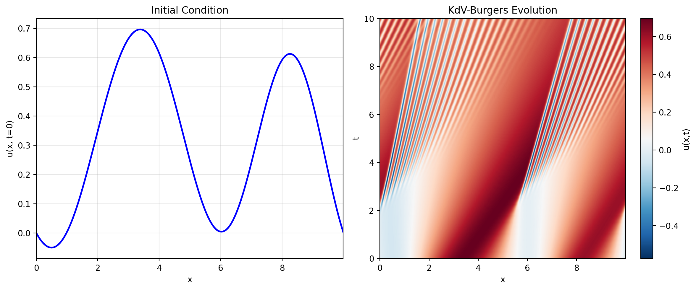

# Shallow Water Equations Dataset

Numerical solutions to the viscous shallow water equations on a sphere using spectral methods.



## Equations

The dataset simulates the viscous shallow water equations on a rotating sphere:

**Momentum equation:**
```
∂u/∂t + ν∇⁴u + g∇h + 2Ω × u = -u·∇u
```

**Continuity equation:**
```
∂h/∂t + ν∇⁴h + H∇·u = -∇·(hu)
```

Where:
- **u** is the velocity field (2-component vector)
- **h** is the height perturbation field
- **ν** is kinematic viscosity
- **g** is gravitational acceleration
- **Ω** is the Earth's rotation vector
- **H** is the mean fluid height

## Variables

The dataset returns a dictionary with the following fields:

### Coordinates
- `spatial_coordinates`: (Nphi×Ntheta, 2) - Flattened (phi, theta) coordinate pairs
- `phi_coords`: (Nphi, Ntheta) - Longitude grid
- `theta_coords`: (Nphi, Ntheta) - Colatitude grid  
- `lat_coords`: (Nphi, Ntheta) - Latitude grid
- `time_coordinates`: (time_steps,) - Time points in hours

### Initial Conditions
- `u_initial`: (2, Nphi, Ntheta) - Initial velocity field
- `h_initial`: (Nphi, Ntheta) - Initial height perturbation
- `vorticity_initial`: (Nphi, Ntheta) - Initial vorticity field

### Solution Trajectories
- `u_trajectory`: (time_steps, 2, Nphi, Ntheta) - Velocity field evolution
- `h_trajectory`: (time_steps, Nphi, Ntheta) - Height field evolution
- `vorticity_trajectory`: (time_steps, Nphi, Ntheta) - Vorticity field evolution

### Physical Parameters
- `alpha`: Perturbation width parameter
- `beta`: Perturbation latitude scale parameter
- `R`: Earth radius (6.37122×10⁶ m)
- `Omega`: Earth rotation rate (7.292×10⁻⁵ rad/s)
- `nu`: Kinematic viscosity
- `g`: Gravitational acceleration (9.80616 m/s²)
- `H`: Mean fluid height (10⁴ m)

### Grid Parameters
- `Nphi`: Number of longitude points
- `Ntheta`: Number of latitude points

## Dataset Parameters

- **Domain**: Spherical surface (φ ∈ [0, 2π], θ ∈ [0, π])
- **Default grid**: 256×128 (longitude × latitude)
- **Time range**: 0 to 360 hours (default)
- **Spatial resolution**: Spectral (dealiased at 3/2 factor)
- **Temporal resolution**: 600 seconds (10 minutes)
- **Save interval**: Every 5 hours (default)

### Physical Parameters
- **Earth radius**: R = 6.37122×10⁶ m
- **Rotation rate**: Ω = 7.292×10⁻⁵ rad/s
- **Viscosity**: ν = 1×10⁵ m²/s / 32² (Reynolds number dependent)
- **Gravity**: g = 9.80616 m/s²
- **Mean height**: H = 10⁴ m
- **Jet maximum velocity**: 80 m/s
- **Perturbation amplitude**: 120 m

### Random Parameters (per sample)
- **Alpha range**: [0.05, 0.6] - Controls perturbation width in longitude
- **Beta range**: [0.02, 0.3] - Controls perturbation width in latitude

## Physical Context

This dataset simulates atmospheric or oceanic flows on a rotating sphere governed by the shallow water equations. The system models large-scale geophysical fluid dynamics, including:

- **Zonal jet streams** with realistic velocity profiles
- **Geostrophic balance** between pressure gradients and Coriolis forces
- **Rossby waves** and other planetary-scale motions
- **Vorticity dynamics** in rotating reference frames

Each sample begins with a balanced zonal jet (resembling atmospheric jet streams) perturbed by a localized height anomaly. The evolution showcases:
- Jet instability and wave breaking
- Vortex formation and interaction
- Energy cascades in geophysical turbulence
- Conservation of potential vorticity

This dataset is relevant for:
- Atmospheric and oceanic modeling
- Climate dynamics
- Geophysical fluid dynamics research
- Weather prediction algorithms
- Machine learning for Earth system modeling

## Usage

```python
from dataset import ShallowWaterDataset

# Create dataset
dataset = ShallowWaterDataset(
    Nphi=256,           # Longitude points
    Ntheta=128,         # Latitude points
    stop_sim_time=360,  # Hours
    save_interval=5     # Save every 5 hours
)

# Generate a sample
sample = next(iter(dataset))

# Access solution data
u_evolution = sample["u_trajectory"]      # Velocity field
h_evolution = sample["h_trajectory"]      # Height field
vorticity = sample["vorticity_trajectory"] # Vorticity field
times = sample["time_coordinates"]        # Time points
alpha, beta = sample["alpha"], sample["beta"] # Parameters
```

## Visualization

Run the plotting scripts to visualize samples:

```bash
python plot_sample.py      # 4-panel static visualization on sphere
python plot_animation.py   # Animated vorticity evolution
```

The plotting functions create 3D spherical visualizations showing the evolution of vorticity fields over time, with proper Earth-like pole orientation.

## Data Generation

Generate the full dataset:

```bash
python generate_data.py
```

This creates train/test splits saved as chunked parquet files in the `data/` directory. The generation uses smaller default parameters (128×64 grid, 100-hour simulations) for efficiency while maintaining the same physics.

## File Structure

```
datasets-shallow-water-dedalus/
├── dataset.py              # Main dataset class
├── plot_sample.py           # 4-panel spherical visualization
├── plot_animation.py        # Animated GIF generation
├── generate_data.py         # Dataset generation script
├── requirements.txt         # Python dependencies
├── README.md               # This file
└── sample_plot.png         # Example visualization
```