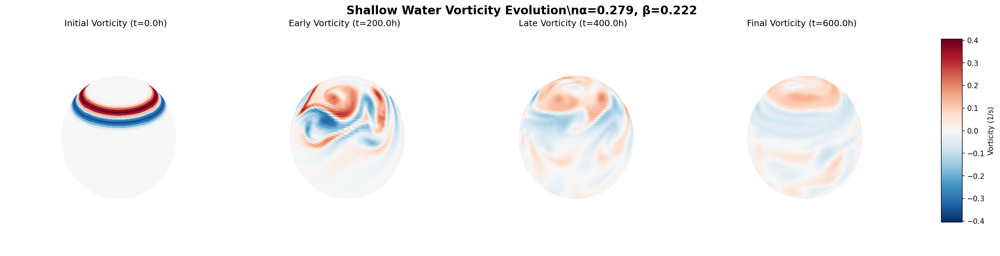

# [YOUR PDE NAME] Dataset

INSTRUCTIONS FOR CLAUDE:
1. Replace the title with your specific PDE (e.g., "Heat Equation Dataset", "Navier-Stokes Dataset")  
2. Update the description with your equation and physical context
3. Replace the equation with your PDE in mathematical notation
4. Update variables section with your dataset's return dictionary fields
5. Update parameters with your PDE-specific parameters
6. Add any additional sections relevant to your PDE (boundary conditions, physical interpretation, etc.)

Numerical solutions to the [DIMENSION]D [YOUR EQUATION NAME].



## Equation

<!-- TODO: Replace with your PDE in mathematical notation -->
**Template**: ∂u/∂t = [YOUR_PDE_TERMS]

**Examples**:
- Heat equation: ∂u/∂t = α∇²u
- Wave equation: ∂²u/∂t² = c²∇²u  
- Navier-Stokes: ∂u/∂t + (u⋅∇)u = -∇p/ρ + ν∇²u

## Variables

<!-- TODO: Update this section with your dataset's return dictionary fields -->
The dataset returns a dictionary with the following fields:

### Coordinates
- `spatial_coordinates`: ([spatial_dims]) - Spatial grid points
- `time_coordinates`: (time_steps,) - Time points

### Solution Fields
- `u_initial`: ([spatial_dims]) - Initial condition
- `u_trajectory`: (time_steps, [spatial_dims]) - Primary solution field evolution
<!-- Add your additional fields:
- `v_trajectory`: (time_steps, [spatial_dims]) - Secondary field (if applicable)
- `p_trajectory`: (time_steps, [spatial_dims]) - Pressure field (for fluids)
- `energy`: (time_steps,) - Energy over time
- `vorticity`: (time_steps, [spatial_dims]) - Vorticity field
-->

### Parameters (if included)
<!-- TODO: List any PDE parameters included in the dataset
- `diffusion_coeff`: Diffusion coefficient value
- `wave_speed`: Wave propagation speed
- `reynolds_number`: Reynolds number (for fluids)
-->

## Dataset Parameters

<!-- TODO: Update with your specific parameters -->
- **Domain**: [DOMAIN_DESCRIPTION] (e.g., [0, 10] for 1D, [0,1]×[0,1] for 2D)
- **Grid points**: [GRID_SIZE] (e.g., 1024 for 1D, 128×128 for 2D)
- **Time range**: [0, FINAL_TIME]
- **Spatial resolution**: [RESOLUTION_INFO]
- **Temporal resolution**: [TIME_STEP_INFO]

### PDE-Specific Parameters
<!-- TODO: Add your equation coefficients and parameters
- **Diffusion coefficient**: α = [VALUE]
- **Wave speed**: c = [VALUE] 
- **Viscosity**: ν = [VALUE]
- **Boundary conditions**: [DESCRIPTION]
-->

## Physical Context

<!-- TODO: Add description of the physical system
**Template**: This dataset simulates [PHYSICAL_SYSTEM] governed by the [EQUATION_NAME]. 
The equation models [PHYSICAL_PHENOMENA] and is relevant for [APPLICATIONS].

**Examples**:
- Heat diffusion in a rod with various initial temperature profiles
- Wave propagation with different boundary conditions
- Fluid flow in a lid-driven cavity at various Reynolds numbers
-->

## Usage

```python
from dataset import YourDataset  # Replace with your actual class name

# Create dataset
dataset = YourDataset()

# Generate a sample
sample = next(iter(dataset))

# Access solution data
spatial_coords = sample["spatial_coordinates"]
solution = sample["u_trajectory"]
times = sample["time_coordinates"]
```

## Visualization

Run the plotting scripts to visualize samples:

```bash
python plot_sample.py      # Static visualization
python plot_animation.py   # Animated evolution
```

## Data Generation

Generate the full dataset:

```bash
python generate_data.py
```

This creates train/test splits saved as chunked parquet files in the `data/` directory.